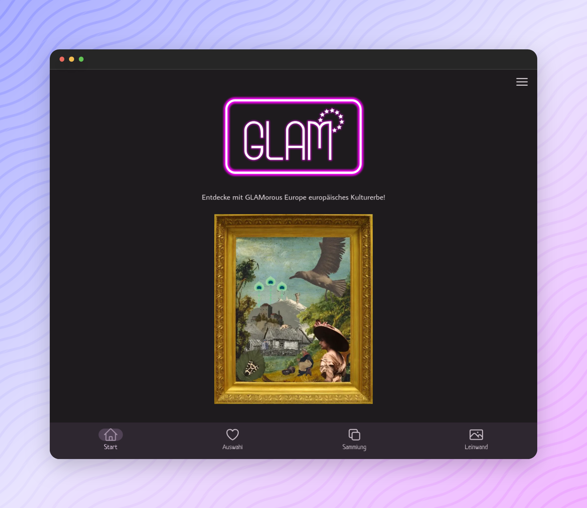

<p align="center">
  <a href="https://www.glam-europe.de/">
    
  </a>
</p>

---

[](https://www.glam-europe.de/)

## About [_GLAMorous Europe_](https://www.glam-europe.de/)

**GLAMorous Europe** is a project within the Prototype Fund Round 14 (September 2023 to February 2024).

The project aims to bring together users and digital collections from European GLAM institutions (Galleries, Libraries, Archives & Museums) in an artistic and creative way. 

By integrating Wikidata APIs to make accessable a broad range of collections, the webapp uses a swipe system to figure out the users artistic interests based on a small range of different digitized objects (photographs, paintings and sketches). 

Based on these preferences, the user gets suggestions for digital collections which might be of interest for this person. 

By using mix&match options, favorite pieces can be combined into a new work of art and shared analogue or digitally. 
Further information about the cultural objects can be accessed directly via linked entries on Wikipedia/Wikidata. 

The focus of **GLAMorous Europe** is on openly licensed collections from all over Europe, mainly focussed on neighbouring countries of Germany.

We warmly invite GLAM institutions to cooperate with us within the **GLAMorous Europe** project.

## Feedback

Feel free to send us feedback on [Twitter](https://twitter.com/digiwako) or [file an issue](https://github.com/digitalwarenkombinat/glamorouseurope/issues/new). Feature requests are always welcome.

## Getting started

Run the following command on your local environment:

```
git clone --depth=1 https://github.com/digitalwarenkombinat/glamorouseurope.git
cd glamorouseurope
npm install
```

You can run the application in development mode with live reload:

```
npm run dev
```

Open http://localhost:3000 with your favorite browser to see the application.

```
.
├── README.md            # README file
├── vite.config.js       # Vite configuration
├── public               # Public folder for assets and fonts
├── src                  # UI components
└── tsconfig.json        # TypeScript configuration
```

You can see the results locally in production mode with:

```
npm run build
npm run preview
```

The generated HTML and CSS files are minified (built-in feature from Vite).
